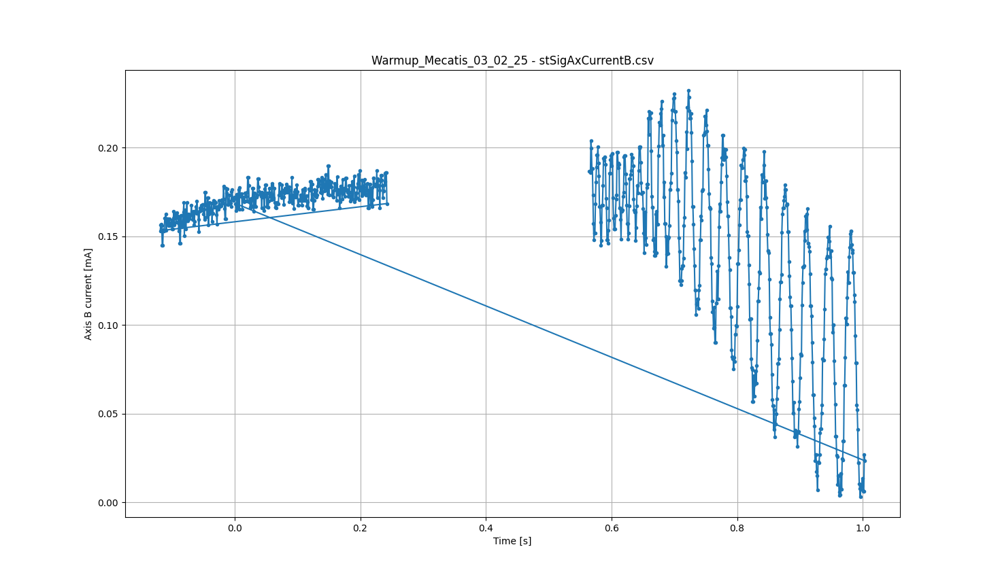
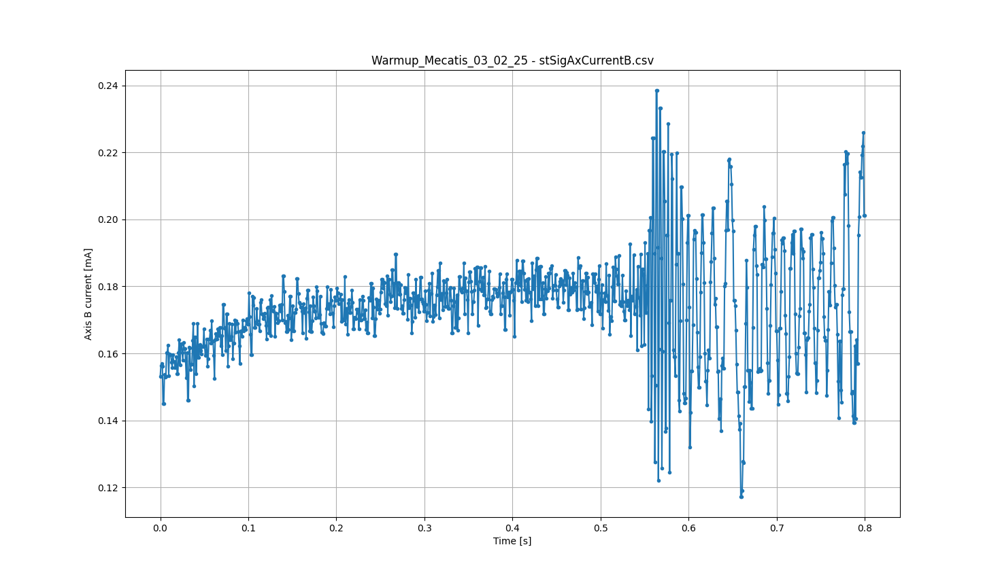
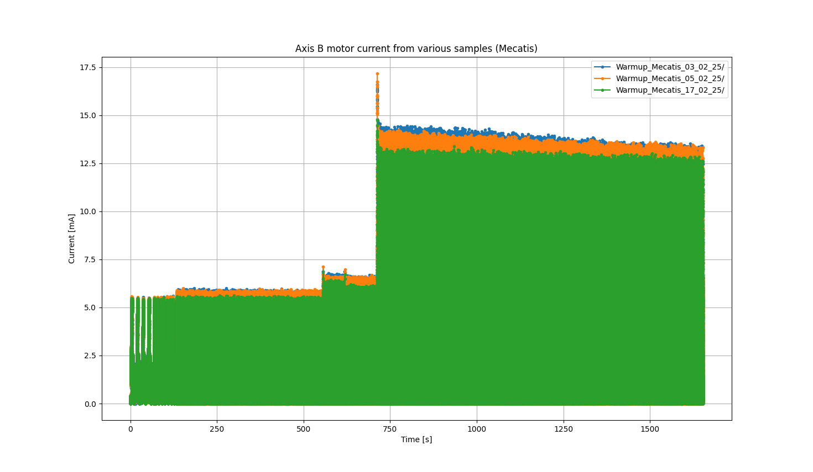
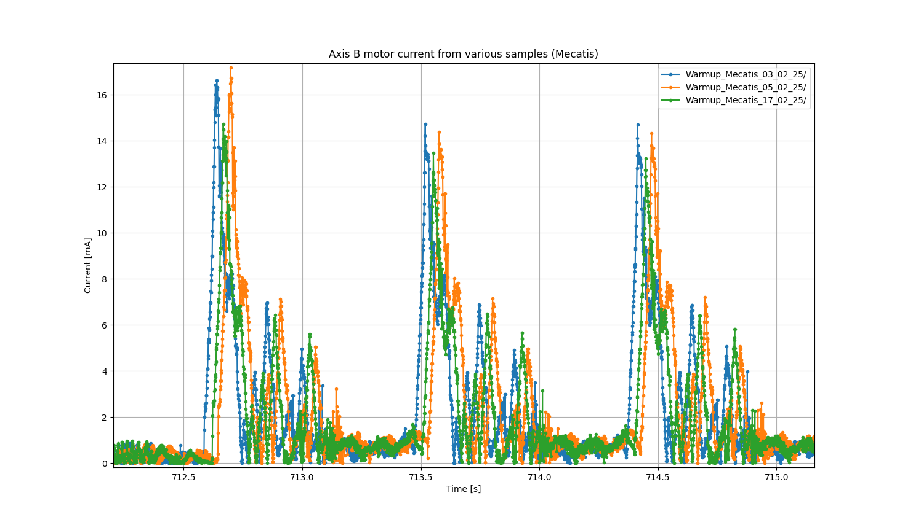
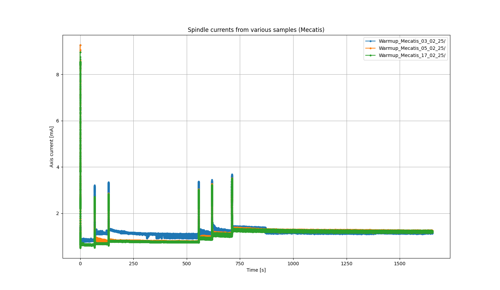
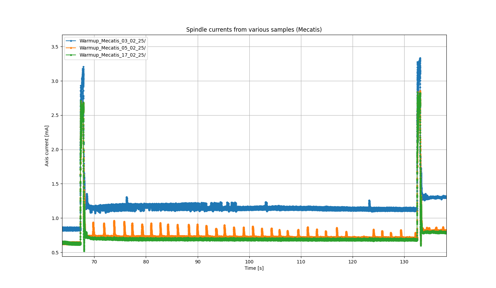

# Project intermediate results (2025.03.20)

## Sorting data points by time

The original data points are not sorted by timestamp, and also have duplicate timestamps.

After sorting:

## Plot axis B current from different samples

We see that:

- the various signals are not perfectly aligned
- We have a lot of variation for one single machine -> currents are influenced by the temperature!!

## Spindle currents

On the orange signal: weird vibrations appear on the signal -> do a Fourier transform to determine what these frequencies could be.

