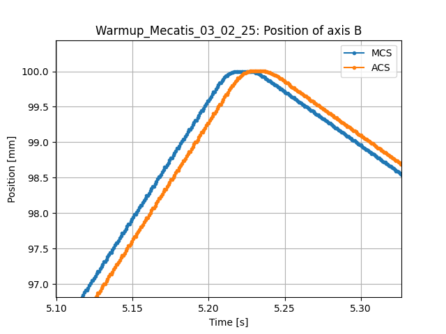

# Project intermediate results (2025.03.27)

## changelog

- more robust path handling (can call functions from various places without having path issues)
- `plotSignals`: add automatic filtering of useful signals
- implemented `normalizeSignal`
- implemented `removeDuplicates`

## Compare ACS and MCS data

ACS is the axis reference frame for the positions and MCS the machine reference frame. By plotting the two types of position, we see that we have basically the same signal, with a slight time shift 0f 0.02s.

## Spindle temperature

On the plot below, we see that the spindle temperature sensor was not connected properly (or had another issue) during the sample taken on the 3 feb.

## Spindle current and speed

We see a correlation between current and speed of the spindle. Speed transitions are when the highest current peaks happen. Also, the speed command is not abrupt but follows some slopes (probably 3rd or 5th degree polynomial).

## Plot axis B position, velocity and current

Plotting the normalized signals to ensure plot is readable. We see a clear correlation between the three signals.

