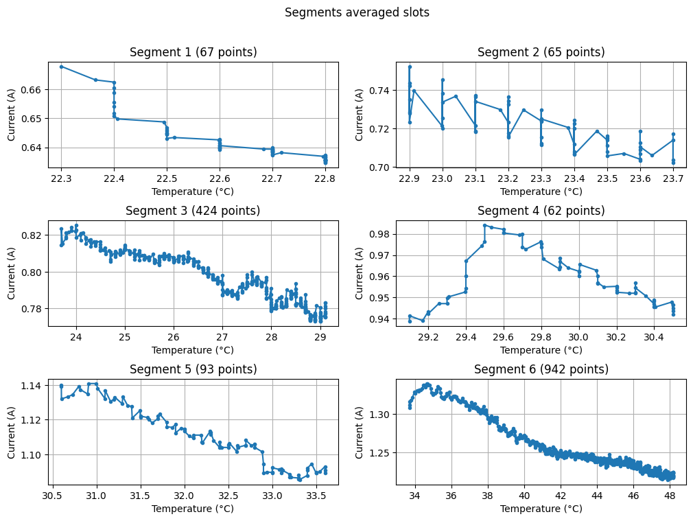

# Project intermediate results (2025.05.01)

## Issue with segments indices

Two main aspects:

- the signals don't have the same length from one sample to another
- the segment indices vary as well (approximately 15 points offsets)

**Example:** Here are the segment indices of two signals:

- Mecatis_05_02_25: [(893, 84083), (84959, 165527), (166403, 694810), (695686, 772705), (773581, 889295), (890171, 2065465)]
- Mecatis_17_02_25: [(893, 84072), (84948, 165512), (166388, 694795), (695670, 772677), (773552, 889265), (890141, 2065435)]

## Temperature correction progress

I noticed that the size of the time slots has a big influence on the regression. Plus sometimes the points are not sorted. Should we sort them by default to ensure increasing temperature?

Below: example of how the averaged segments look like with dt = 1s

## TODO

- Verify the impact of our data normalization on the sampling frequency. Why do different machines have different sampling frequencies?
- Implement function to compute the sampling frequency of a signal

## Questions

- Why are there different numbers of points from one sample to another?
  - Is it because the warmup program was different?
  - Related to when the sensors start and stop, which isn't always the same?
