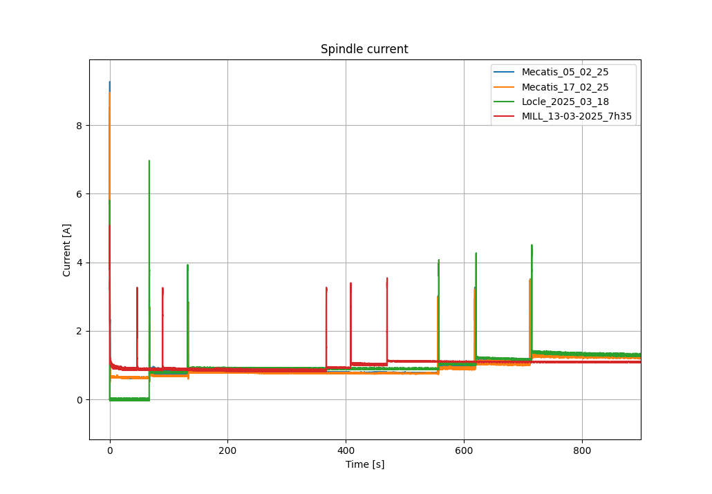
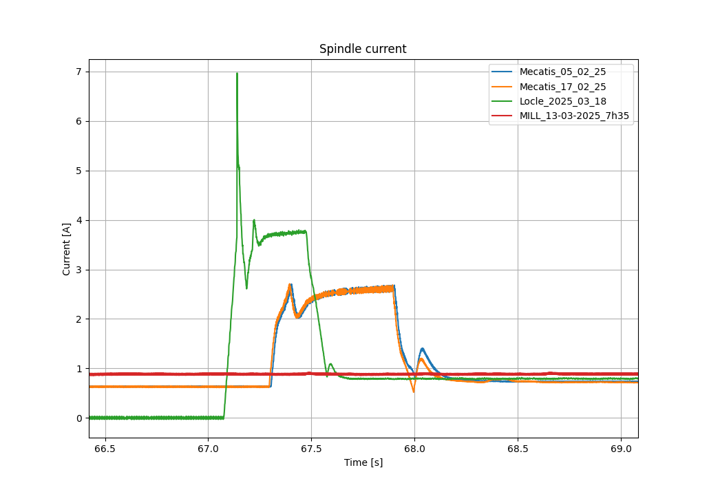

# Project intermediate results (2025.05.08)

## Checking override signals

The goal is to see if the override signals are modified or not. For this, the `utils/checkOverride` function is used.

The function was run on all the samples, and here are the results:

```txt
                                 feedRate spindle feedRateIndex spindleIndex
Locle_2025_03_18                        0       1          None      1389580
Locle_2025_03_20                        0       0          None         None
MILL_13-03-2025_10h35                   1       0             0         None
MILL_13-03-2025_7h35                    1       0             0         None
MILL_19-02-2025_9h20                    1       0             0         None
Mecatis_03_02_25                        0       0          None         None
Mecatis_05_02_25                        0       0          None         None
Mecatis_10_03_25                        0       0          None         None
Mecatis_10_03_25_2                      0       0          None         None
Mecatis_10_03_25_3                      0       0          None         None
Mecatis_10_03_25_4                      0       0          None         None
Mecatis_10_03_25_5                      0       0          None         None
Mecatis_17_02_25                        0       0          None         None
Mecatis_20_01_25_AV_chang_Axe_X      None    None          None         None
Mecatis_20_01_25_apres_chgt_AxeX        0       0          None         None
Mecatis_24_03_25                        0       0          None         None
```

For the MILL machine, the `feedRateOverride` signal has a constant value of 102.43 for all points of all samples.

Command to select the two override signals in parquet files:

```sql
SELECT lrSigFeedRateOverride, lrSigSpindleOverride FROM data
```

## Align X axis

### Plotting spindle current from all machines





## Various notes

- dynamic time warping: allows to compare two signals that have similar features but that do not vary at the same speed! This could be really useful to realign the segments I think!!  
  https://en.wikipedia.org/wiki/Dynamic_time_warping
- for next years: have a group working only on developing a good data generation workflow, and who would generate a good dataset for others to work on
- function waits for spindle to reach target speed, which can change from sample to sample -> tool can be different!!!
- acquisition frequency depends on machine: depending on the type of automaton to register the data, they have a limiting acquisition frequency... This will stay because different industries will have different controllers

## Questions

- do all machines have the same sensors?
