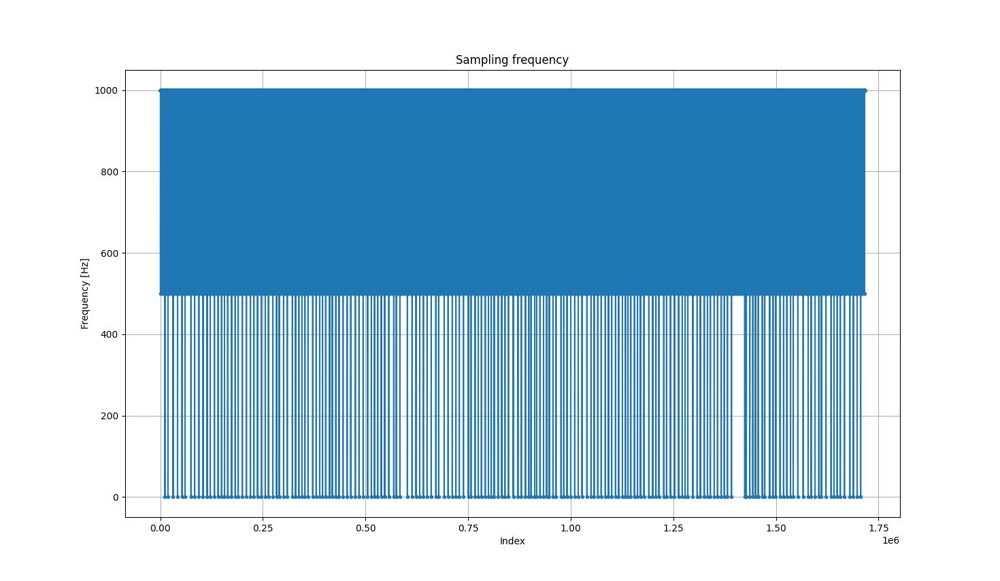
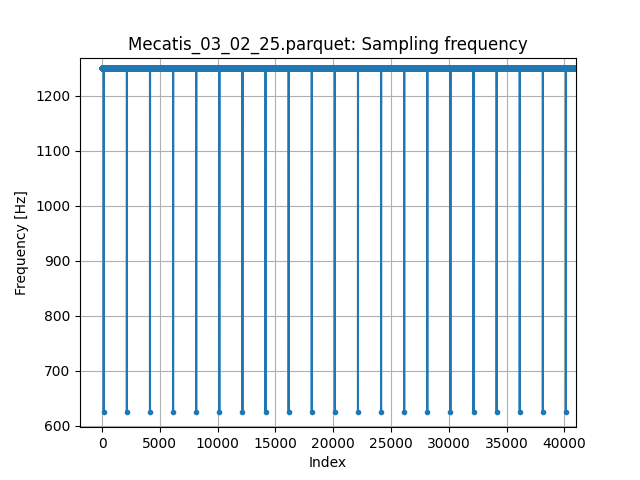
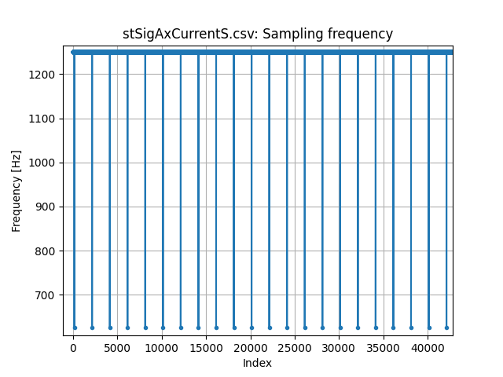
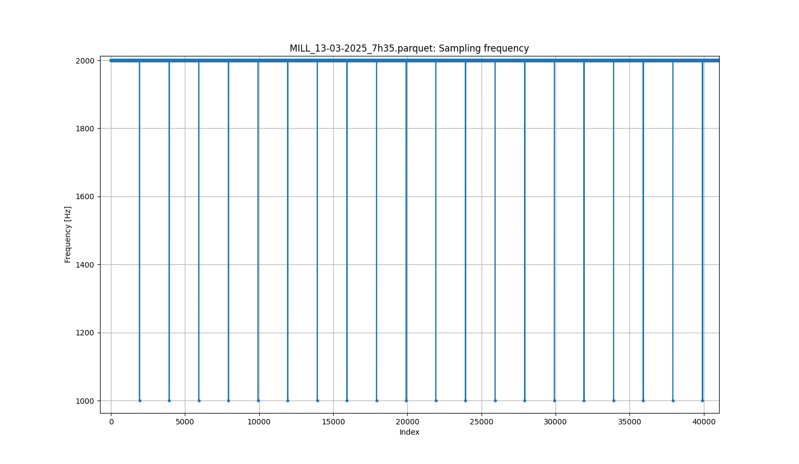

# Project intermediate results (2025.05.15)

## Plot sampling frequency

We want to plot the frequency of the samples. It should be a constant value -> they should be no time holes.

Currently we have weird behavior: For example with the Locle machine, we find frequencies at 1000, 500 and 0.5 Hz. Is there a bug in the data normalisation function?

Plotting the frequency of the Mecatis machine. Top plot is from the normalized data, and bottom one from the original data. We can see that the frequency issue was already present in the original data.

Finally, here is the plot for the MILL machine:

## Sampling frequency for the different machines

The different machines have different sampling frequencies. This depends on the controller of each machine and cannot be fixed. Varying frequencies are to be expected.

How to solve this? Systematically interpolate the samples at a fixed frequency, for example 1000Hz?

Frequencies for each machine:

- Locle: 1000 Hz
- Mecatis: 1250 Hz
- MILL: 2000 Hz
