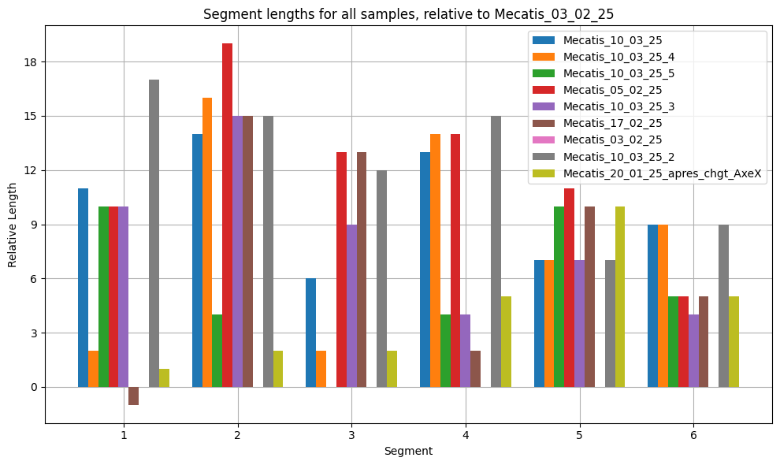
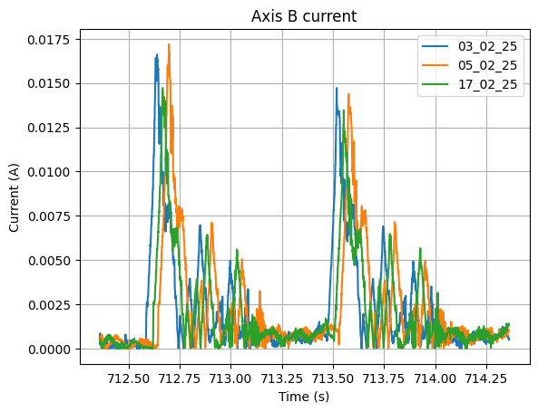
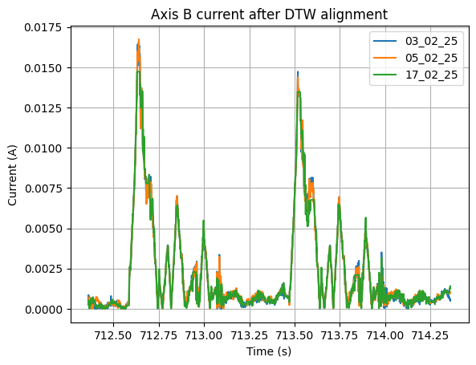

# Summary of improvements of phase 3 (2025.05.22)

- Fix normalising function:
  - By default interpolate all data at a frequency of 2000Hz
  - Create a machine properties file which contains info on the specific machines, typically the unit used for current signal (amperes of milli-amperes). Convert all currents to amperes in the normalization function
- "Check" functions: Functions to detect issues with the data
- Alignment functions
- Function to plot sample frequency to verify frequency is correct
- `findCommonSection`: get common section of two segments with offset

## Segments' length

- between 70000 and 1e6 points in the segments
- segments' length varies from sample to sample -> ploblematic for comparison
- we computed all of the segments' length and subtracted the lengths of a reference sample, in our case Mecatis_03_02_25
- maximum length difference: 19 points
- The Locle and MILL machines do not have the signal which we use for the segmentation

## The solution to everything? Dynamic time warping

Tests on the Mecatis machine data.

