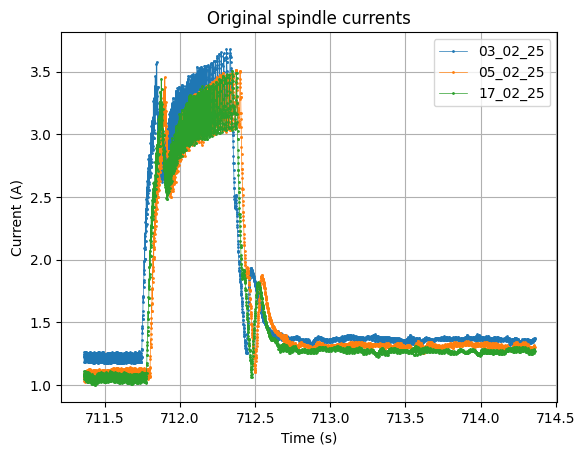
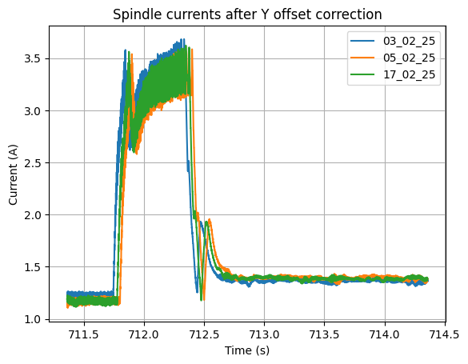

# Summary of improvements of phase 3 (2025.05.22)

- Fix normalising function:
  - By default interpolate all data at a frequency of 2000Hz
  - Create a machine properties file which contains info on the specific machines, typically the unit used for current signal (amperes of milli-amperes). Convert all currents to amperes in the normalization function
- "Check" functions: Functions to detect issues with the data
- Alignment functions
- Function to plot sample frequency to verify frequency is correct
- `findCommonSection`: get common section of two segments with offset

## Segments' length

- between 70000 and 1e6 points in the segments
- segments' length varies from sample to sample -> ploblematic for comparison
- we computed all of the segments' length and subtracted the lengths of a reference sample, in our case Mecatis_03_02_25
- maximum length difference: 19 points
- The Locle and MILL machines do not have the signal which we use for the segmentation

## The solution to everything? Dynamic time warping

The lib currently used for DTW actually doesn't work on signals with a lot of points. It even makes the jupyter kernel crash when signal is around 2e5 points long. For a signal of 2e4 points, it takes 22s to run to align 2 signals on a reference...

Tests on the Mecatis machine data: Axis B current

Spindle current: We can see that DTW does not handle it very well when there is a y offset.

## Using X and Y alignment instead of DTW

## Comparison of errors between signals and reference

- Machine: Mecatis
- Reference signal: 03_02_25

| Description          | 05_02_25 | 17_02_25 |
| -------------------- | -------- | -------- |
| Original data        | 0.316    | 0.245    |
| After DTW            | 0.442    | 0.345    |
| After only Y offset  | 0.305    | 0.216    |
| After X and Y offset | 0.126    | 0.126    |

## Best solution: Combination of both?

- split signals into segments
- normalize segments?
- remove Y offset
- then run DTW to align in X and avoid problems caused by segments having different lengths
